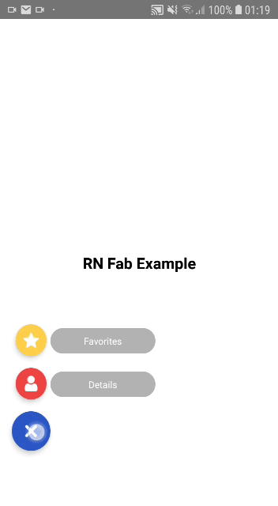
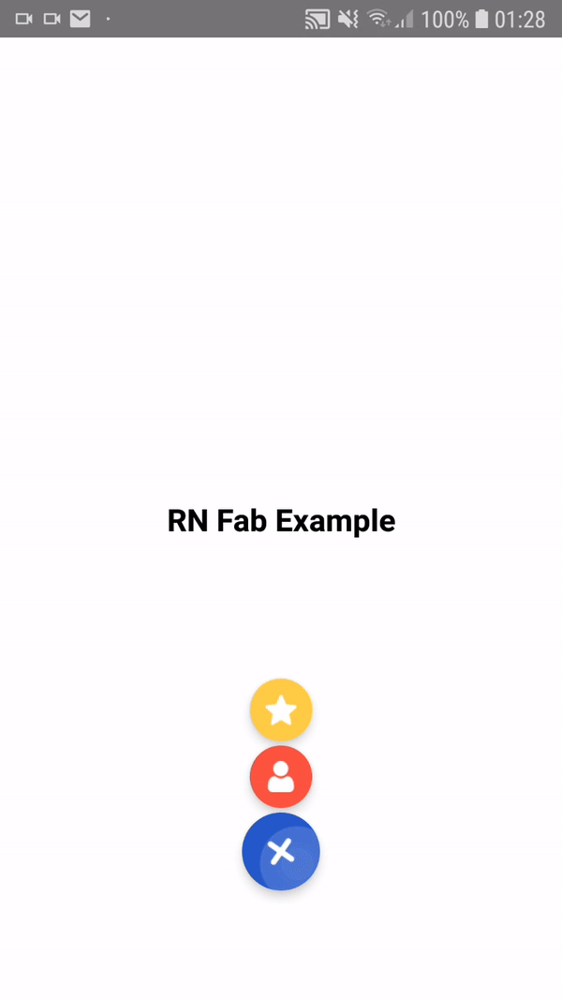
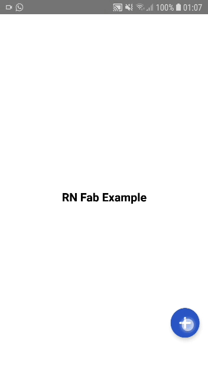

# rn-fab 

Simple React Native <strong>Floating Action Button</strong> using NativeDriver for high-performance animations and Ripple effect for button.
Works on iOS and Android.

<p align="center">
  
  
  
</p>

##  Install

Instale as dependências do backend
```sh
$ yarn add rn-fab
```
or
```sh
$ npm i rn-fab --save
```

## Example
Access the example folder and install de modules
```sh
cd examble && yarn install
```
run on android (or ios):
```sh
npx react-native run-android
```

## Use it!

Import the component:
```sh
import Fab from 'rn-fab';
```
Setup the buttons:
```sh
const actions = [
  // Main button - does not need to receive the "text" property.
  {
    icon: <Image source={PlusIcon} style={styles.icon} />,
    name: "btn_plus",
    color: '#2a57c6'
  },
  // Action Buttons - will be displayed when you tap the main button.
  {
    text: "Details",
    icon: <Image source={UserIcon} style={styles.icon} />,
    name: "btn_detail",
    color: '#ee4343'
  },
  {
    text: "Favorites",
    icon: <Image source={StarIcon} style={styles.icon} />,
    name: "btn_favorite",
    color: '#fdce4b'
  }
];
```
Setup component:
```sh
<View style={styles.container}>
  <Text style={styles.text}>RN Fab Example</Text>
  <Fab
    actions={actions}
    style={{right: 40, bottom: 120}}
    rotation={"45deg"}
    onPress={name => {
      if(name == "btn_detail"){
        alert(`Hi, you clicked on ${name}`)
      }
    }}
  />
</View>
```
If you want the button on the <strong>right</strong>, just use:
```sh
style={right: 40, bottom: 150}}
```
or nothing to <strong>center</strong> it:
```sh
style={bottom: 150}}
```

## Fab Component Specifications

| Property | Type | Default | Description |
| -------- | ---- | ------- | ----------- |
| actions | array | [] | Buttons that will be displayed when the user taps the fab button. |
| onPress | function | null | Actions that will be performed when pressing each button. |
| style | object | {} | Fab button main style. Setup position here. | 
| rotation | string | "45deg" | Degrees of rotation of the FAB button icon. | 

## Fab Action Buttons Specifications

| Property | Type | Default | Description |
| -------- | ---- | ------- | ----------- |
| text | string | null | Label text for action button. if it is null it will not be displayed. Does not apply to first item of array (main button) |
| icon | any | null | Icon to be rendered inside the action button. Will accept React.Image. |
| name | string | null | Name of the action button. This name is used as parameter for onPress action. |
| color | string | #000 | Rotation degrees of the main button icon animation. | 

## License
MIT © - See [LICENSE](http://google.com) for more information.